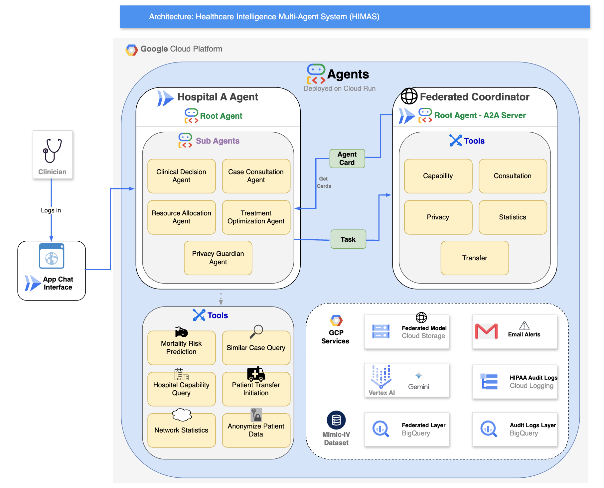

# 🏥 HIMAS: Healthcare Intelligence Multi-Agent System

[](https://opensource.org/licenses/Apache-2.0)
[](https://www.python.org/)
[](https://cloud.google.com/run)
[](https://airflow.apache.org/)

**A privacy-preserving federated learning platform for ICU mortality prediction using Google's Agent Development Kit (ADK) and A2A Protocol.**



---

## Table of Contents

- [Overview](#overview)
- [Key Features](#key-features)
- [Architecture](#architecture)
- [Project Structure](#project-structure)
- [Prerequisites](#prerequisites)
- [Installation](#installation)
- [Configuration](#configuration)
- [Deployment](#deployment)
- [Usage](#usage)
- [Data Pipeline](#data-pipeline)
- [Privacy & Compliance](#privacy--compliance)
- [Model Performance](#model-performance)
- [Testing](#testing)
- [API Reference](#api-reference)

---

## Overview

HIMAS (Healthcare Intelligence Multi-Agent System) is a comprehensive federated learning platform designed for ICU mortality prediction. It enables hospitals to collaboratively train AI models while maintaining strict data privacy and HIPAA compliance.

### What HIMAS Does

- **Predicts ICU Mortality Risk**: Uses admission-time clinical features to assess patient mortality risk
- **Enables Cross-Hospital Collaboration**: Privacy-preserved case consultation across federated hospital network
- **Coordinates Patient Transfers**: Intelligent matching of patient needs with hospital capabilities
- **Maintains HIPAA Compliance**: Dual audit logging, k-anonymity, and differential privacy

### Use Cases

1. **Clinical Decision Support**: Real-time mortality risk assessment for ICU patients
2. **Case Consultation**: Query similar cases from peer hospitals without exposing PHI
3. **Resource Optimization**: Match patient needs with available hospital resources
4. **Transfer Coordination**: Facilitate patient transfers with capability matching

---

## Key Features

### Multi-Agent Architecture
| Agent | Role | Key Functions |
|-------|------|---------------|
| **Hospital A Agent** | Primary hospital interface | Risk prediction, treatment optimization |
| **Federated Coordinator** | A2A hub for cross-hospital queries | Privacy-preserved aggregation |
| **Clinical Decision** | Mortality risk assessment | ML model inference |
| **Case Consultation** | Similar case queries | Cross-hospital search |
| **Treatment Optimization** | Evidence-based recommendations | Protocol matching |
| **Resource Allocation** | Capacity management | Bed/staff optimization |
| **Privacy Guardian** | Compliance enforcement | Audit logging, anonymization |

### Privacy-Preserving Technologies
- **K-Anonymity (k=5)**: Minimum group size for query results
- **Differential Privacy (ε=0.1)**: Laplace noise for statistical queries
- **Patient-Level Splitting**: No data leakage across train/validation/test
- **HIPAA Audit Logging**: Dual logging to Cloud Logging + BigQuery

### GCP Integration
- **Cloud Run**: Serverless agent deployment
- **BigQuery**: Federated data storage and analytics
- **Cloud Storage**: Model artifacts and DVC versioning
- **Vertex AI**: Gemini 2.0 Flash for agent reasoning
- **Cloud Logging**: HIPAA-compliant audit trails
- **Gmail SMTP**: Pipeline status notifications

---

## Architecture

### System Components

```
┌─────────────────────────────────────────────────────────────────────────┐
│                    Google Cloud Platform                                  │
│  ┌──────────────────────────────────────────────────────────────────┐   │
│  │                        Agents (Cloud Run)                          │   │
│  │  ┌────────────────────┐        ┌─────────────────────────────┐   │   │
│  │  │  Hospital A Agent  │        │   Federated Coordinator     │   │   │
│  │  │    (Root Agent)    │◄──────►│   (A2A Server)              │   │   │
│  │  │  ┌──────────────┐  │ Agent  │  ┌─────────┬─────────────┐  │   │   │
│  │  │  │ Sub Agents:  │  │ Card   │  │  Tools  │             │  │   │   │
│  │  │  │ • Clinical   │  │        │  │ • Capability Query    │  │   │   │
│  │  │  │ • Treatment  │  │ Task   │  │ • Consultation        │  │   │   │
│  │  │  │ • Resource   │  │◄──────►│  │ • Transfer            │  │   │   │
│  │  │  │ • Privacy    │  │        │  │ • Statistics          │  │   │   │
│  │  │  │ • Consult    │  │        │  │ • Privacy             │  │   │   │
│  │  │  └──────────────┘  │        │  └───────────────────────┘  │   │   │
│  │  └────────────────────┘        └─────────────────────────────┘   │   │
│  └──────────────────────────────────────────────────────────────────┘   │
│                                                                           │
│  ┌─────────────┐  ┌──────────────┐  ┌──────────────┐  ┌──────────────┐  │
│  │  BigQuery   │  │Cloud Storage │  │  Vertex AI   │  │Cloud Logging │  │
│  │ • Federated │  │ • Models     │  │ • Gemini 2.0 │  │ • HIPAA Logs │  │
│  │ • Audit Logs│  │ • DVC Data   │  │   Flash      │  │ • Alerts     │  │
│  └─────────────┘  └──────────────┘  └──────────────┘  └──────────────┘  │
└─────────────────────────────────────────────────────────────────────────┘
```

### Data Flow

1. **Clinician** logs into App Chat Interface
2. **Hospital A Agent** receives query and routes to appropriate sub-agent
3. **Sub-agents** invoke specialized tools (prediction, query, etc.)
4. **Cross-hospital queries** flow through A2A protocol to Federated Coordinator
5. **Privacy Guardian** ensures all operations are HIPAA-compliant
6. **Audit logs** written to Cloud Logging and BigQuery

### A2A Protocol Flow

```
Hospital A ──► Get Agent Cards ──► Federated Coordinator
     │                                      │
     │         Agent Card Response          │
     ◄──────────────────────────────────────┤
     │                                      │
     │         Task Request (Privacy-Safe)  │
     ├──────────────────────────────────────►
     │                                      │
     │         Aggregated Response          │
     ◄──────────────────────────────────────┤
```

---

## Project Structure

```
himas-agents/
├── agent_hospital_a/              # Hospital A Agent (ADK)
│   ├── agent.py                   # Root agent definition
│   ├── config.py                  # Configuration settings
│   ├── data_mappings.py           # Feature mappings
│   ├── prompt.py                  # System instructions
│   ├── requirements.txt           # Dependencies
│   ├── subagents/                 # Specialized sub-agents
│   │   ├── clinical_decision/     # Mortality risk prediction
│   │   │   ├── agent.py
│   │   │   ├── prompt.py
│   │   │   └── tools/
│   │   │       ├── model_loader.py
│   │   │       └── prediction.py
│   │   ├── case_consultation/     # Cross-hospital case queries
│   │   │   ├── agent.py
│   │   │   ├── prompt.py
│   │   │   └── tools/
│   │   │       ├── privacy_tools.py
│   │   │       └── query_tools.py
│   │   ├── treatment_optimization/ # Treatment recommendations
│   │   │   ├── agent.py
│   │   │   ├── prompt.py
│   │   │   └── tools/
│   │   │       ├── bigquery_tools.py
│   │   │       └── resource_check.py
│   │   ├── resource_allocation/   # Hospital resource management
│   │   │   ├── agent.py
│   │   │   ├── prompt.py
│   │   │   └── tools/
│   │   │       └── allocation_tools.py
│   │   └── privacy_guardian/      # HIPAA compliance
│   │       ├── agent.py
│   │       ├── prompt.py
│   │       └── tools/
│   │           ├── anonymization.py
│   │           ├── audit_logging.py
│   │           └── notification_tools.py
│   └── utils/                     # Shared utilities
│       ├── bigquery_client.py
│       ├── data_preprocessor.py
│       └── feature_extractor.py
│
├── remote_a2a/                    # Federated Coordinator (A2A)
│   ├── agent.py                   # A2A client wrapper
│   ├── federated_coordinator/
│   │   ├── agent.py               # Coordinator root agent
│   │   ├── main.py                # Uvicorn entry point
│   │   ├── prompt.py              # System instructions
│   │   ├── Procfile               # Cloud Run deployment
│   │   ├── requirements.txt
│   │   └── tools/
│   │       ├── capability_tools.py    # Hospital capability queries
│   │       ├── consultation_tools.py  # Similar case search
│   │       ├── transfer_tools.py      # Patient transfer coordination
│   │       ├── statistics_tools.py    # Network statistics
│   │       ├── privacy_tools.py       # Anonymization utilities
│   │       └── config.py              # Coordinator config
│   └── README.md
│
├── deployment/                    # Deployment scripts
│   ├── deploy.py                  # Programmatic deployment
│   └── test_deployment.py         # Deployment verification
│
├── eval/                          # Evaluation framework
│   ├── data/
│   │   ├── preauth.test.json      # Test cases
│   │   └── test_config.json       # Eval configuration
│   └── test_eval.py               # Evaluation runner
│
├── tests/                         # Unit tests
│   ├── test_agents.py             # Agent tests
│   ├── test_feature_extractor.py  # Feature extraction tests
│   └── verify_import.py           # Import verification
│
├── deploy_all_agents.sh           # One-click deployment script
├── demo_check_model_prediction.md # Model validation documentation
├── demo_interaction.md            # Demo interaction examples
├── pyproject.toml                 # Project configuration
└── README.md                      # This file
```

---

## Prerequisites

### Required Software
- **Python 3.11+**
- **Google Cloud SDK** (gcloud CLI)
- **UV** (Python package manager) or pip

### GCP Services
- Cloud Run
- BigQuery
- Cloud Storage
- Vertex AI (Gemini API enabled)
- Cloud Logging
- IAM & Admin

### API Keys
- Google Cloud Application Default Credentials
- Gemini API access (via Vertex AI)

---

## Installation

### 1. Clone the Repository

```bash
git clone https://github.com/your-org/himas-agents.git
cd himas-agents
```

### 2. Set Up Python Environment

```bash
# Using UV (recommended)
uv venv
source .venv/bin/activate
uv sync

# Or using pip
python -m venv .venv
source .venv/bin/activate
pip install -e .
```

### 3. Configure GCP Authentication

```bash
# Login to GCP
gcloud auth login
gcloud auth application-default login

# Set project
gcloud config set project YOUR_PROJECT_ID
```

### 4. Install Google ADK

```bash
pip install google-adk
```

---

## Configuration

### Environment Variables

Create a `.env` file or set these environment variables:

```bash
# GCP Configuration
export GOOGLE_CLOUD_PROJECT="your-project-id"
export GOOGLE_CLOUD_LOCATION="us-central1"

# Agent Configuration
export COORDINATOR_URL="https://federated-coordinator-xxxxx.run.app"
export HOSPITAL_ID="hospital_a"

# Privacy Settings
export K_ANONYMITY_THRESHOLD=5
export DIFFERENTIAL_PRIVACY_EPSILON=0.1

# Email Alerts (optional)
export ALERT_EMAILS="your-email@example.com"
```

### Agent Configuration (`agent_hospital_a/config.py`)

```python
class Config:
    PROJECT_ID = os.getenv("GOOGLE_CLOUD_PROJECT", "erudite-carving-472018-r5")
    LOCATION = "US"
    HOSPITAL_ID = "hospital_a"
    MODEL_BUCKET = "himas-models"
    MODEL_PATH = "hospital_a/federated_model.keras"
```

---

## Deployment

### One-Click Deployment

```bash
chmod +x deploy_all_agents.sh
./deploy_all_agents.sh
```

This deploys:
1. **Hospital A Agent** (ADK + UI) → Cloud Run
2. **Federated Coordinator** (A2A Server) → Cloud Run

### Manual Deployment

#### Deploy Hospital A Agent

```bash
cd agent_hospital_a
adk deploy cloud_run \
  --project=$GOOGLE_CLOUD_PROJECT \
  --region=us-central1 \
  --service_name=hospital-a-agent \
  --with_ui
```

#### Deploy Federated Coordinator

```bash
cd remote_a2a/federated_coordinator
gcloud run deploy federated-coordinator \
  --source=. \
  --region=us-central1 \
  --memory=2Gi \
  --allow-unauthenticated
```

### Verify Deployment

```bash
# Check Hospital A Agent
curl https://hospital-a-agent-xxxxx.run.app/health

# Check Coordinator Agent Card
curl https://federated-coordinator-xxxxx.run.app/.well-known/agent-card.json
```

---

## Usage

### Local Development

```bash
# Run Hospital A Agent locally
cd agent_hospital_a
adk web

# Run Federated Coordinator locally
cd remote_a2a/federated_coordinator
uvicorn main:a2a_app --host 0.0.0.0 --port 8001
```

### Example Interactions

#### 1. Mortality Risk Assessment

```
User: Assess mortality risk for a 78-year-old emergency admission patient 
      who was admitted to ICU within 2 hours of hospital admission.

Agent: Based on the clinical assessment:

       **Patient Profile:**
       - Age: 78 years (elevated risk factor)
       - Admission Type: EMERGENCY
       - Time to ICU: 2 hours (early_icu_score = 3, highest severity)
       
       **Mortality Risk: 76.5% (HIGH)**
       
       Key risk factors:
       • Advanced age (+12.9pp)
       • Emergency admission (+10pp)
       • Urgent ICU transfer within 6 hours (+38.9pp)
       
       Recommended actions:
       1. Continuous vital sign monitoring
       2. Early palliative care consultation
       3. Consider ICU step-down protocols
```

#### 2. Cross-Hospital Case Consultation

```
User: Query similar cases from other hospitals for patients aged 70-75 
      with emergency admission and early ICU score of 3.

Agent: Querying federated network with privacy protections...

       **Results from Hospital B (Tertiary Care Center):**
       - Similar cases found: 23 (k-anonymity satisfied)
       - Survival rate: 0.28 (72% mortality)
       - Average ICU LOS: 156.3 hours
       - Differential privacy applied: ε=0.1
       
       **Results from Hospital C (Rural Hospital):**
       - Cases found: < 5 (k-anonymity NOT met)
       - Results suppressed for privacy protection
```

#### 3. Patient Transfer Coordination

```
User: Initiate transfer to a hospital with cardiac surgery capability 
      for patient fingerprint abc123.

Agent: Checking network capabilities...

       **Transfer Initiated:**
       - Transfer ID: xfer_20250106_143022
       - Source: Hospital A (Community Hospital)
       - Target: Hospital B (Tertiary Care Center)
       - Capability: cardiac_surgery ✓
       - ICU beds available: 12
       - Estimated transport: 45 minutes
       - Status: CONFIRMED
```

---

## Data Pipeline

HIMAS integrates with an Apache Airflow data pipeline for data processing:

### Pipeline Layers

| Layer | Dataset | Purpose |
|-------|---------|---------|
| **Curated** | `curated` | Dimensional model (star schema) |
| **Federated** | `federated` | Hospital-partitioned data |
| **Verification** | `verification` | Quality checks & statistics |

### Key Tables

```sql
-- Curated Layer
curated.dim_patient          -- Patient demographics
curated.fact_hospital_admission  -- Admission events
curated.fact_icu_stay        -- ICU stay details
curated.clinical_features    -- ML-ready features

-- Federated Layer
federated.hospital_a_data    -- Hospital A (40% patients)
federated.hospital_b_data    -- Hospital B (35% patients)
federatedhospital_b.hospital_c_data    -- Hospital C (25% patients)

-- Verification Layer
verification.data_leakage_check   -- Zero overlap verification
verification.dataset_statistics   -- Comprehensive stats
```

### Running the Pipeline

```bash
cd PoC/Data-Pipeline
docker-compose up -d

# Trigger DAG
docker-compose run airflow-worker airflow dags trigger himas_bigquery
```

---

## Privacy & Compliance

### HIPAA Compliance Measures

| Measure | Implementation |
|---------|----------------|
| **Access Control** | IAM roles, service accounts |
| **Audit Logging** | Cloud Logging + BigQuery dual write |
| **Data Encryption** | At-rest (GCS) and in-transit (TLS) |
| **Minimum Necessary** | K-anonymity enforces minimum group size |
| **De-identification** | SHA-256 patient fingerprints |

### Privacy Technologies

#### K-Anonymity (k=5)
```python
# Query results with fewer than 5 patients are suppressed
if result_count < K_ANONYMITY_THRESHOLD:
    return {"message": "Insufficient cases for privacy-safe reporting"}
```

#### Differential Privacy (ε=0.1)
```python
# Laplace noise added to aggregate statistics
noise_scale = 1.0 / DIFFERENTIAL_PRIVACY_EPSILON
noisy_count = count + np.random.laplace(0, noise_scale)
```

#### Patient-Level Splitting
```sql
-- Patients are assigned to hospitals and splits by subject_id hash
-- No patient appears in multiple hospitals or splits
WHERE psa.assigned_hospital = 'hospital_a'
  AND psa.data_split = 'train'
```

### Audit Log Schema

```json
{
  "timestamp": "2025-01-06T14:30:22.123Z",
  "operation": "MORTALITY_PREDICTION",
  "hospital_id": "hospital_a",
  "user_id": "clinician_001",
  "patient_fingerprint": "a3f2c1...",
  "risk_score": 0.765,
  "privacy_checks": {
    "k_anonymity": true,
    "differential_privacy": true,
    "hipaa_compliant": true
  }
}
```

---

## Model Performance

### Training Data Statistics

| Metric | Value |
|--------|-------|
| Total ICU Stays | 59,573 |
| Total Patients | ~50,000 |
| Mortality Rate | 11.6% |
| Train/Val/Test Split | 70%/15%/15% |

### Feature Impact Analysis

| Feature | Impact on Risk | Example |
|---------|----------------|---------|
| **early_icu_score** | +38.9 pp | <6h to ICU = highest risk |
| **n_icu_transfers** | +20.6 pp | Multiple ICU transfers = instability |
| **age_at_admission** | +12.9 pp | 85yo vs 35yo |
| **admission_type** | +10 pp | Emergency vs Elective |
| **los_icu_hours** | <1 pp | Small changes insignificant |

### Model Architecture

```
Input (27 features) → Dense(64, relu) → Dropout(0.3)
                    → Dense(32, relu) → Dropout(0.3)
                    → Dense(1, sigmoid) → Risk Score
```

### Demo Scenarios

| Scenario | Profile | Risk |
|----------|---------|------|
| **Low Risk** | 55yo, elective, 72h delayed ICU, no transfers | ~32% |
| **Medium Risk** | 65yo, emergency, 12h to ICU, 1 transfer | ~55% |
| **High Risk** | 82yo, emergency, 1h urgent ICU, 3 transfers | ~85% |

---

## Testing

### Run Unit Tests

```bash
# All tests
pytest tests/ -v

# Specific test file
pytest tests/test_agents.py -v

# With coverage
pytest tests/ --cov=agent_hospital_a --cov-report=html
```

### Run Agent Evaluation

```bash
cd eval
python test_eval.py
```

### Verify Imports

```bash
python tests/verify_import.py
```

### Test Deployment

```bash
python deployment/test_deployment.py
```

---

## API Reference

### Hospital A Agent Tools

| Tool | Function | Parameters |
|------|----------|------------|
| `predict_mortality_risk` | ML-based risk prediction | `age`, `admission_type`, `hours_admit_to_icu`, ... |
| `query_similar_cases` | Cross-hospital case search | `age_bucket`, `admission_type`, `early_icu_score` |
| `check_hospital_resources` | Resource availability | `resource_type`, `quantity_needed` |
| `anonymize_patient` | Create patient fingerprint | `subject_id`, `age` |
| `log_audit_event` | HIPAA audit logging | `operation`, `details` |

### Federated Coordinator Tools

| Tool | Function | Returns |
|------|----------|---------|
| `query_hospital_capabilities` | Find hospitals with capability | List of matching hospitals |
| `query_similar_cases` | Aggregated case statistics | Privacy-preserved stats |
| `initiate_transfer` | Coordinate patient transfer | Transfer confirmation |
| `get_transfer_status` | Check transfer status | Current status |
| `get_network_statistics` | Network-wide statistics | Aggregated metrics |
| `anonymize_patient_data` | Create anonymous representation | Patient fingerprint |

### A2A Protocol Endpoints

```
GET  /.well-known/agent-card.json  # Agent discovery
POST /tasks                        # Submit task
GET  /tasks/{task_id}              # Get task status
```

---

## Acknowledgments

- **MIMIC-IV**: PhysioNet for the healthcare dataset
- **Google ADK**: Agent Development Kit framework
- **Apache Airflow**: Workflow orchestration
- **Flower**: Federated learning framework

---

<div align="center">

**Built with ❤️ for Healthcare AI**

*HIMAS - Healthcare Intelligence Multi-Agent System*

Federated Learning • Privacy-Preserved • HIPAA Compliant

</div>