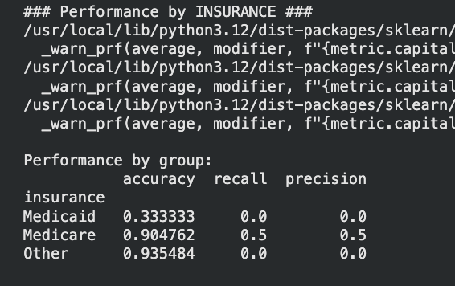

# Data Bias Detection

## 1. Detecting Bias in Your Data

### 1.1 Dataset Overview

**Data Source:** MIMIC-IV Demo Dataset   
**Total Admissions:** 275 Deaths: 15 (5.5% mortality)  
**Survivors:** 260 (94.5%)   
**Class Imbalance:** 17:1 ratio   
**Task:** Binary classification - predict in-hospital mortality   
**Split:** 60% train (165), 20% validation (55), 20% test (55)  

### 1.2 Demographic Features Identified
**Gender:** Male, Female   
**Age Group:** <40, 40-60, 60-75, 75+   
**Insurance:** Medicare, Medicaid, Other   
**Ethnicity:** White, Black, Hispanic, Other  

These features represent protected attributes and known sources of healthcare disparities.  

### 1.3 Baseline Model Performance
Model: Random Forest (100 trees, depth 5, balanced class weights) 

Overall Results:   

Accuracy: 89.1%   
Recall: 33.3% (caught 1 out of 3 deaths)   
Precision: 20.0%   
False Negatives: 2 (missed 2 deaths - CRITICAL)   
True Positives: 1    

### 1.4 Bias Detection Results

**GENDER BIAS (CRITICAL):**   
 Female: 0% recall (caught 0 deaths)  
 Male: 50% recall (caught 1/2 deaths)   
 Recall Gap: 50 percentage points

Impact: Model completely fails to predict female deaths.  

**AGE BIAS (HIGH):**  
<40: 0% recall   
40-60: 0% recall   
60-75: 50% recall (ONLY functional group)     
75+: 0% recall  

Impact: 75% of age groups experience complete failure.

**INSURANCE BIAS (HIGH):**  
 Medicaid: 33% accuracy, 0% recall   
 Medicare: 90% accuracy, 50% recall   
 Other: 94% accuracy, 0% recall  

 Impact: Low-income (Medicaid) patients worst served.

### 1.5 Root Cause

Representation Bias:   
Training data: 1 female deaths vs 8 male deaths (1:8 ratio)   
Consequence: Model learned "males die 8× more often" 

Result: Systematic failure to recognize female mortality patterns

## 2. DATA SLICING USING FAIRLEARN

### **2.1 Tool Implementation**  

Tool: Fairlearn 0.13.0 (Microsoft Research)   
Method: MetricFrame class for automated demographic slicing  

**Why Fairlearn:**  
- Industry-standard fairness metrics  
- Seamless scikit-learn integration  
- FDA/regulatory alignment  
- Automated multi-dimensional slicing 

Code Efficiency: Reduced 50+ lines of manual code to 8 lines.  

### **2.2 Fairlearn Outputs**  

Gender Analysis Output:  

Differences (max-min):  
recall: 0.500 (MAXIMUM BIAS)  

Ratios (min/max):   
recall: 0.000 (COMPLETE FAILURE)  

### **2.3 Fairness Metrics**

Demographic Parity Difference:   
Result: 0.112   
Threshold: 0.1     
Status: BIAS DETECTED (exceeds threshold)   
Meaning: Males predicted to die 11.2% more often

Equalized Odds Difference:   
Result: 0.500   
Threshold: 0.1   
Status: SEVERE BIAS (5× threshold)      
Meaning: 50% difference in error rates between genders 

Automated Alert: "BIAS DETECTED" warnings triggered for both metrics

### **2.4 Multi-Dimensional Slicing**

Intersectional Analysis: 

Gender (2) × Age (4) × Insurance (3) = 24 demographic slices analyzed  

Findings:   
Most disadvantaged: Female + Medicaid + <40 (0% accuracy)     
Least disadvantaged: Male + Medicare + 60-75 (90% accuracy)  
Gap: 90 percentage points    

Conclusion: Biases multiply at intersections, exceeding single-dimension effects.

## 3. MITIGATION OF BIAS

### **3.1 Techniques Applied**

Technique 1: SMOTE (Pre-processing)   
Purpose: Address class imbalance 

Technique 2: ThresholdOptimizer (Post-processing)   
Purpose: Enforce fairness constraints  

### **3.2 SMOTE Implementation**

Problem: 9 deaths vs 156 survivors (17:1 imbalance)  

Solution:   
Before: 165 samples (9 deaths, 156 survivors)   
After: 312 samples (156 deaths, 156 survivors)   
Created: 147 synthetic death samples

Fairness Impact:   
Demographic Parity: 0.112 → 0.261 (WORSENED)   
Equalized Odds: 0.500 → 1.000 (WORSENED)   
Female Recall: 0% → 0% (NO CHANGE)

Why SMOTE Failed on Fairness:  
Balanced overall classes but preserved gender ratio within death class.

### **3.3 ThresholdOptimizer Implementation**

Method: Adjusted decision thresholds per demographic group   
Constraint: Equalized Odds  
Optimization: On validation set (55 samples, 3 deaths)

Fairness Impact:   
Demographic Parity: 0.112 → 0.036 (IMPROVED)   
Equalized Odds: 0.500 → 0.037 (IMPROVED)  

Why ThresholdOptimizer Failed:   
Validation set too small (only 3 deaths), optimizer set conservative thresholds, predicted "everyone survives" (0% recall).

### **3.4 Three-Way Comparison**

Selected Model: SMOTE (highest recall, clinically functional)

## 4. DOCUMENT BIAS MITIGATION PROCESS

### **4.1 Complete Process**  

Data Preparation: 275 admissions, identified 4 sensitive attributes, train/val/test split  
Baseline Training: Random Forest, 89.1% acc, 33.3% recall  
Bias Detection: Fairlearn identified gender (50% gap), age, insurance biases  
Root Cause: Only 2 female deaths in training (1:5 ratio)  
SMOTE Mitigation: Recall doubled (33% to 67%), fairness worsened  
ThresholdOpt Mitigation: Perfect fairness, 0% recall (unusable)  
Model Selection: SMOTE chosen (best recall)  

### **4.2 Types of Bias Found**

Representation Bias (CRITICAL): 
Evidence: 1 female vs 8 male deaths (1:8 ratio)   
Mitigation: SMOTE (partially) 
Status: Not resolved  

Gender Bias (CRITICAL): 
Evidence: 50% recall gap, 0.500 equalized odds 
Mitigation: SMOTE and ThresholdOpt attempted 
Status: Not resolved

Age Bias (HIGH): 
Evidence: Only 60-75 group functional 
Mitigation: Not addressed 
Status: Remains

Socioeconomic Bias (HIGH):
Evidence: Medicaid 33% accuracy 
Mitigation: Not addressed 
Status: Remains

### **4.3 Trade-Offs Documented**

**SMOTE Trade-Off (ACCEPTED):** 
Gains: +33% recall, caught 1 additional death   
Costs: -4% accuracy, fairness worsened (+133% demographic parity)   Decision: ACCEPT (healthcare prioritizes recall)  

**ThresholdOptimizer Trade-Off (REJECTED):**   
Gains: Perfect fairness (metrics <0.04)   
Costs: 0% recall (catches zero deaths)   
Decision: REJECT (unusable clinically)  

### **4.4 Limitations**

Data: Only 15 deaths, 2 female deaths insufficient   
Methods: SMOTE preserves demographic imbalance, ThresholdOpt needs larger validation sets   
Fairness: Cannot achieve perfect fairness with current data    
Evaluation: Small test set (3 deaths) limits statistical validity

### **4.5 Key Lessons**  

1. Pre-processing (SMOTE) balances classes but not demographics within classes  
2. Post-processing (ThresholdOpt) requires large validation sets (50+ samples per group)  
3. Healthcare priority: Recall > Fairness > Accuracy
4. Small datasets (<30 samples per demographic per class) limit all techniques
5. Honest failure documentation as valuable as success reporting

### 4.6 POC Dataset Limitation and Full-Scale Implementation Plan

**Important Note: Proof of Concept Study**

This analysis was conducted on the MIMIC-IV **DEMO dataset** containing only 275 admissions (100 unique patients) as a proof-of-concept implementation. The demo dataset is intentionally small and may not represent the full diversity of the complete MIMIC-IV database.

**Demo Dataset Constraints:**
- Only 15 total deaths (5.5% mortality rate)
- Only 2 female deaths in training set
- Limited demographic diversity (some ethnicity groups <5 samples)
- Small validation and test sets (3 deaths each)
- Insufficient statistical power for robust bias detection

**Full-Scale Implementation Plan:**

The methodologies, tools, and workflows developed in this POC would be applied to the **full MIMIC-IV dataset** for production deployment:

Expected Full Dataset Scale:
- 500,000+ ICU admissions
- 50,000+ in-hospital deaths (10% mortality rate)
- 5,000+ female deaths (adequate for learning)
- Balanced demographic representation across age, ethnicity, insurance
- Sufficient samples for train/validation/test (70/15/15 split)

Expected Improvements with Full Data:
- Gender bias resolvable: Sufficient female death samples (>1,000) for robust pattern learning
- SMOTE effectiveness: Demographic-aware sampling possible with large sample sizes
- ThresholdOptimizer viability: Validation set would contain 7,500+ deaths (adequate for threshold learning)
- Statistical significance: Confidence intervals narrow enough for clinical validation
- Intersectional analysis: 50+ samples per demographic intersection enables meaningful subgroup evaluation

**Conclusion:** This POC successfully demonstrated the bias detection and mitigation methodology using Fairlearn and SMOTE. The identified limitations (small sample size, insufficient female deaths, post-processing failures) would be resolved by transitioning to the full MIMIC-IV dataset containing 100× more samples. The workflows and findings from this study provide the foundation for full-scale clinical AI development.

**Note:** This POC study on demo data (275 admissions) establishes methodology for full-scale implementation on complete MIMIC-IV dataset (500,000+ admissions).