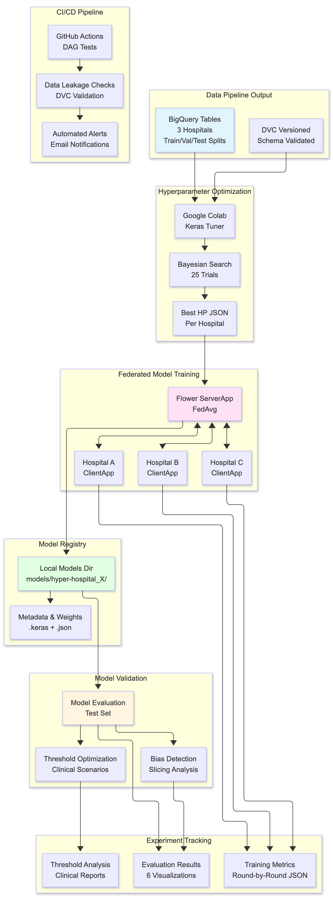
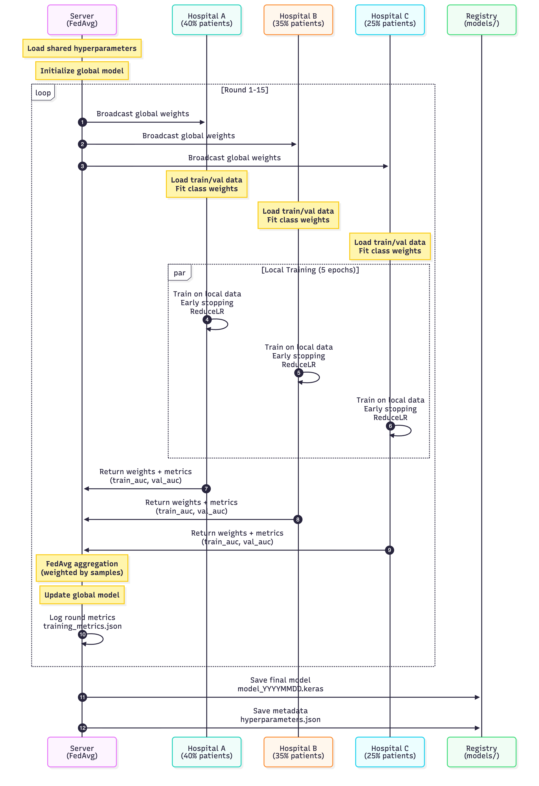
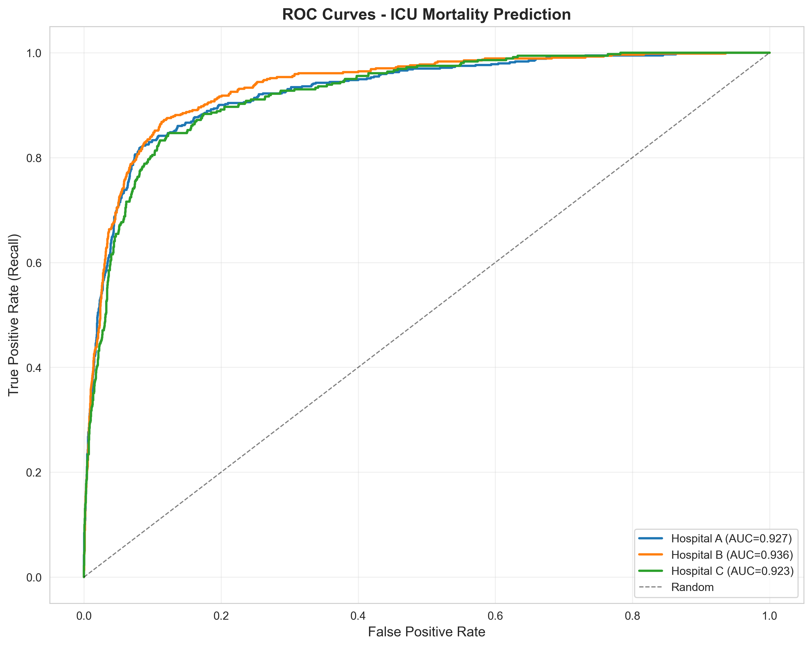
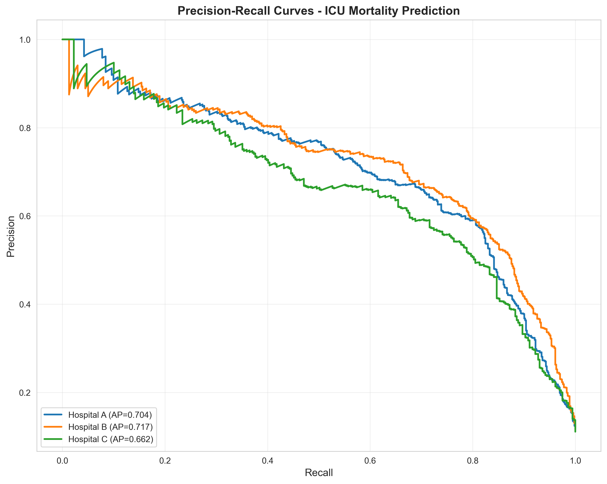
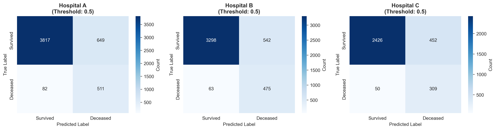
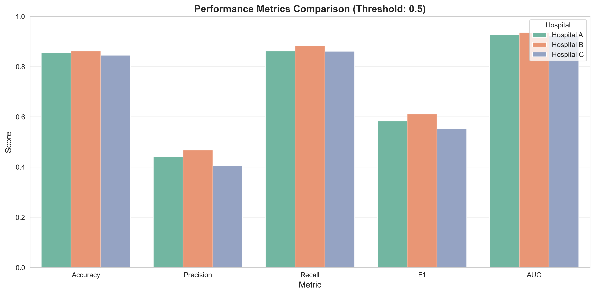
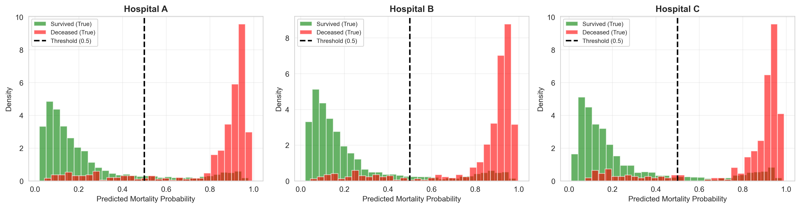
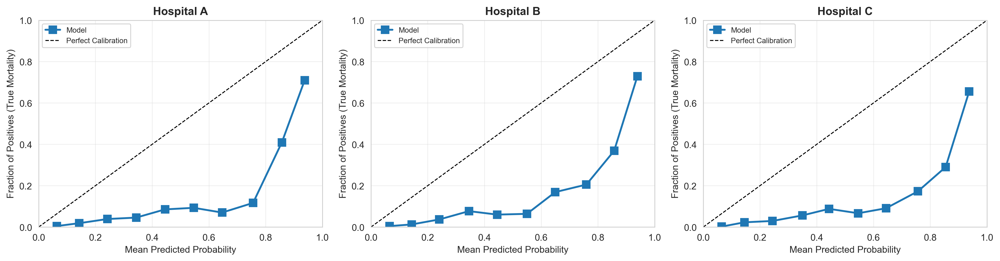
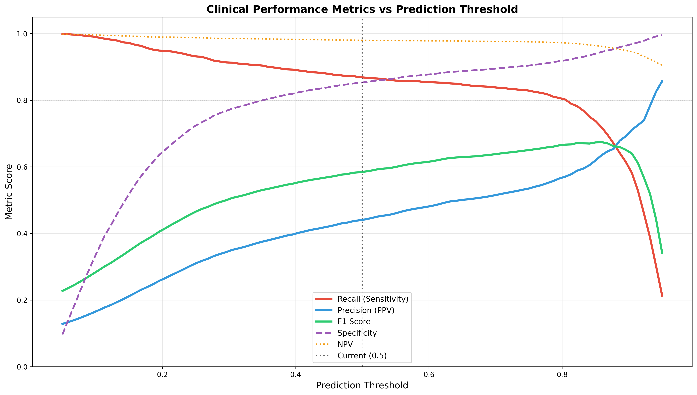
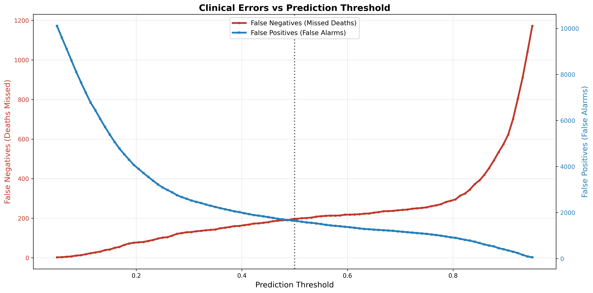

# HIMAS Federated Learning Model Pipeline

**Healthcare Information Management and Analytics System** - Federated learning platform for ICU mortality prediction using MIMIC-IV medical data across distributed hospitals while maintaining HIPAA compliance and patient data privacy.

---

## Table of Contents

* [Overview](#overview)
* [Project Structure](#project-structure)
* [Prerequisites](#prerequisites)
* [Installation](#installation)

  * [1. Clone Repository](#1-clone-repository)
  * [2. Create Virtual Environment](#2-create-virtual-environment)
  * [3. Install Dependencies](#3-install-dependencies)
  * [4. Configure Google Cloud](#4-configure-google-cloud)
  * [5. Docker-Based Setup](#5-docker-based-setup)
* [Data Pipeline Integration](#data-pipeline-integration)
* [Model Training](#model-training)

  * [Hyperparameter Tuning](#hyperparameter-tuning)
  * [Federated Learning Training](#federated-learning-training)
* [Model Validation](#model-validation)

  * [Model Evaluation](#model-evaluation)
  * [Threshold Optimization](#threshold-optimization)
* [Experiment Tracking and Results](#experiment-tracking-and-results)
* [Model Sensitivity Analysis](#model-sensitivity-analysis)
* [Running the Application](#running-the-application)

  * [Simulation Mode](#simulation-mode)
  * [Deployment Mode](#deployment-mode)
  * [Docker Compose Mode (End-to-End Pipeline with MLflow + BigQuery)](#docker-compose-mode-end-to-end-pipeline-with-mlflow--bigquery)
* [Output Artifacts](#output-artifacts)
* [Configuration](#configuration)
* [Resources](#resources)

---

## Overview

HIMAS implements a production-ready federated learning system for ICU mortality prediction that enables three simulated hospitals to collaboratively train machine learning models while maintaining complete data privacy. The system processes ~60,000 training samples across hospitals using the Flower framework for federated orchestration and TensorFlow/Keras for deep learning.

**Key Features:**

* HIPAA-compliant federated learning architecture
* Hospital-specific data partitioning with patient-level splits
* Bayesian hyperparameter optimization (Google Colab GPU)
* Comprehensive model evaluation with 6 visualization types
* Clinical threshold optimization for deployment
* DVC integration for dataset/model versioning
* Automated data quality validation via Apache Airflow

---

## Project Structure

```
Model-Pipeline/
├── himas_model_pipeline/          # Flower federated learning application
│   ├── __init__.py
│   ├── client_app.py              # ClientApp: Hospital-specific training
│   ├── server_app.py              # ServerApp: Federated aggregation
│   └── task.py                    # Shared: Data loading, model building
├── scripts/
│   ├── evaluate_model.py          # Post-training evaluation on test data
│   └── optimize_threshold.py      # Clinical threshold optimization
│   └── Model_Pipeline_Keras_Tuner.ipynb.  # Hyperparameter Tuning Google Colab Notebook
├── models/                        # Trained models organized by hospital
│   ├── hyper-hospital_a/
│   │   ├── himas_federated_mortality_model_YYYYMMDD_HHMMSS.keras
│   │   └── model_metadata_YYYYMMDD_HHMMSS.json
│   ├── hyper-hospital_b/
│   └── hyper-hospital_c/
├── hyperparameters/               # Bayesian-optimized hyperparameters
│   ├── hospital_a_best_hyperparameters.json
│   ├── hospital_b_best_hyperparameters.json
│   └── hospital_c_best_hyperparameters.json
├── evaluation_results/            # Model evaluation artifacts
│   ├── figures/{model_name}/      # 6 visualizations per model
│   │   ├── roc_curves.png
│   │   ├── precision_recall_curves.png
│   │   ├── confusion_matrices.png
│   │   ├── metrics_comparison.png
│   │   ├── prediction_distribution.png
│   │   └── calibration_curves.png
│   └── results/
│       └── evaluation_results_YYYYMMDD_HHMMSS.json
├── threshold_optimization_results/
│   ├── figures/{model_name}/      # Threshold impact visualizations
│   │   ├── threshold_metrics_impact.png
│   │   └── threshold_errors_impact.png
│   └── results/{model_name}/      # Clinical recommendations
│       ├── threshold_analysis_YYYYMMDD_HHMMSS.csv
│       ├── recommendations_YYYYMMDD_HHMMSS.json
│       └── recommendations_YYYYMMDD_HHMMSS.md
├── training_results/              # Round-by-round federated metrics
│   ├── training_metrics.json      # Training metrics per round/hospital
│   └── evaluation_metrics.json    # Validation metrics per round/hospital
├── pyproject.toml                 # Project config & dependencies
└── README.md
```

---

## Prerequisites

* **Python**: 3.11+ (tested with 3.11)
* **Google Cloud Platform**: Active project with BigQuery access
* **BigQuery Dataset**: MIMIC-IV data processed via Data Pipeline (see `../Data-Pipeline/`)
* **Google Colab**: For GPU-accelerated hyperparameter tuning (optional but recommended)
* **Hardware**:

  * Local training: 8GB+ RAM, multi-core CPU
  * Production: GPU recommended for faster training

---

## Installation

### 1. Clone Repository

```bash
git clone <repository-url>
cd Model-Pipeline
```

### 2. Create Virtual Environment

**Using venv (recommended):**

```bash
python -m venv venv
source venv/bin/activate  # Linux/Mac
# OR
venv\Scripts\activate     # Windows
```

**Using conda:**

```bash
conda create -n himas python=3.11
conda activate himas
```

### 3. Install Dependencies

The `pyproject.toml` defines all dependencies including Flower framework:

```bash
pip install flwr
pip install -e .
```

**Core Dependencies Installed:**

* `flwr[simulation]==1.14.0` - Federated learning framework
* `tensorflow==2.18.0` - Deep learning
* `google-cloud-bigquery==3.28.0` - Data access
* `keras-tuner==1.4.7` - Hyperparameter optimization
* `scikit-learn==1.6.1` - Preprocessing & metrics

**Verify installation:**

```bash
flwr --version
python -c "import tensorflow as tf; print(f'TensorFlow {tf.__version__}')"
```

### 4. Configure Google Cloud

**Authenticate:**

```bash
gcloud auth application-default login
gcloud config set project erudite-carving-472018-r5
```

**Set environment variables:**

```bash
export GOOGLE_APPLICATION_CREDENTIALS="path/to/service-account-key.json"
export GOOGLE_CLOUD_PROJECT="erudite-carving-472018-r5"
```

**Verify BigQuery access:**

```bash
bq query --use_legacy_sql=false \
  'SELECT COUNT(*) as count FROM `erudite-carving-472018-r5.federated_demo.hospital_a_data`'
```

### 5. Docker-Based Setup

The project includes a `docker-compose.yml` (under `Model-Pipeline/himas-model-pipeline`) that runs the **end-to-end federated pipeline** with:

* MLflow tracking server
* Flower SuperLink
* Three SuperNodes (one per hospital: A/B/C)
* Evaluator container that pulls data from BigQuery and evaluates the latest model

This is the easiest way to reproduce the full federated run (including BigQuery + MLflow) without manually starting each component.

#### 5.1 Prerequisites for Docker

* **Docker** and **Docker Compose** installed
* `gcloud` configured on the host and **Application Default Credentials (ADC)** created:

```bash
gcloud auth application-default login
gcloud config set project erudite-carving-472018-r5
```

On most systems this creates an ADC file like:

* Linux/Mac: `~/.config/gcloud/application_default_credentials.json`
* Windows: `C:\Users\<YourUser>\AppData\Roaming\gcloud\application_default_credentials.json`

#### 5.2 Configure ADC Mount in docker-compose

In `docker-compose.yml`, the evaluation and training containers mount your local gcloud config directory and use it for `GOOGLE_APPLICATION_CREDENTIALS`. A typical configuration looks like:

```yaml
services:
  superlink:
    build: .
    container_name: himas-superlink
    environment:
      - MLFLOW_TRACKING_URI=http://mlflow:5000
      - MLFLOW_EXPERIMENT_NAME=himas-federated

  supernode-a:
    build: .
    container_name: himas-supernode-a
    depends_on:
      - superlink
      - mlflow
    environment:
      - FLWR_SUPERLINK=superlink:9092
      - FLOWER_NODE_ID=hospital-a
      - FLOWER_PARTITION_ID=0
      - FLOWER_NUM_PARTITIONS=3
      - MLFLOW_TRACKING_URI=http://mlflow:5000
      - MLFLOW_EXPERIMENT_NAME=himas-federated
      - GOOGLE_CLOUD_PROJECT=erudite-carving-472018-r5
      - GOOGLE_APPLICATION_CREDENTIALS=/gcloud/application_default_credentials.json
    volumes:
      # Windows example: update the host path for your user
      - "C:/Users/MargiShah/AppData/Roaming/gcloud:/gcloud:ro"

  supernode-b:
    # same pattern as supernode-a, with FLOWER_PARTITION_ID=1

  supernode-c:
    # same pattern as supernode-a, with FLOWER_PARTITION_ID=2

  evaluator:
    build: .
    container_name: himas-evaluator
    depends_on:
      - mlflow
    environment:
      - MLFLOW_TRACKING_URI=http://mlflow:5000
      - MLFLOW_EXPERIMENT_NAME=himas-federated-eval
      - GOOGLE_CLOUD_PROJECT=erudite-carving-472018-r5
      - GOOGLE_APPLICATION_CREDENTIALS=/gcloud/application_default_credentials.json
    command: >
      bash -c "
        sleep 30 &&
        python scripts/evaluate_model.py
      "
    volumes:
      - ./models:/app/models
      - ./evaluation_results:/app/evaluation_results
      - "C:/Users/MargiShah/AppData/Roaming/gcloud:/gcloud:ro"
```

> **Note:**
>
> * On **Windows**, update the host path (`C:/Users/MargiShah/...`) to match your actual user.
> * On **Linux/Mac**, use `~/.config/gcloud:/gcloud:ro` instead.

#### 5.3 Build Docker Images

From inside `Model-Pipeline/himas-model-pipeline`:

```bash
docker compose build
```

This builds images for:

* `himas-mlflow`
* `himas-superlink`
* `himas-supernode-a`
* `himas-supernode-b`
* `himas-supernode-c`
* `himas-evaluator`

#### 5.4 Run the Federated Pipeline

```bash
docker compose up
```

What happens:

* **MLflow** starts at `http://localhost:5000`
* **SuperLink** starts and listens on `9092` internally
* **SuperNodes A/B/C** connect to SuperLink and are ready for training/evaluation
* **Evaluator**:

  * Loads the latest `himas_federated_mortality_model.keras` from `./models`
  * Connects to **BigQuery** using ADC
  * Pulls test/train data per hospital
  * Fits the preprocessor on training data
  * Evaluates per-hospital + aggregated metrics
  * Saves:

    * JSON: `evaluation_results/results/evaluation_results_YYYYMMDD_HHMMSS.json`
    * Figures: `evaluation_results/figures/{model_name}/...`
  * Logs the run to MLflow (`himas-federated-eval` experiment)
  * Exits with code 0 when finished

You can then:

* Open **MLflow UI** in a browser: `http://localhost:5000`
* Inspect evaluation artifacts on the host under `evaluation_results/`
* Rerun just the evaluator (after training a new model) with:

```bash
docker compose run --rm evaluator
```

---

## Data Pipeline Integration

The model pipeline seamlessly integrates with the upstream Data Pipeline (Apache Airflow). The pipeline follows a four-stage process: data ingestion from BigQuery, hyperparameter optimization via Bayesian search, federated model training across three hospitals, and comprehensive validation with bias detection.

### High Level ML Pipeline Architecture



### Loading Data (task.py)

The `task.py` module handles data loading with proper train/val/test splits:

```python
from himas_model_pipeline.task import load_data_from_bigquery

# Load data for specific hospital partition
partition_id = 0  # hospital_a
num_partitions = 3

x_train, y_train, x_val, y_val = load_data_from_bigquery(
    partition_id=partition_id,
    num_partitions=num_partitions
)

# Data characteristics:
# - Patient-level splitting (no leakage between train/val/test)
# - Hospital-specific partitions (40%, 35%, 25%)
# - Preprocessed features: 15 numerical + 8 categorical
# - Class imbalance: ~11.6% mortality rate
```

**Data Quality Guarantees from Pipeline:**

* Zero patient overlap between splits (verified via `data_leakage_check`)
* Schema validation with statistics tracking
* DVC versioning for reproducibility
* Automated quality checks before model training

---

## Model Training

### Hyperparameter Tuning

**Bayesian optimization using Google Colab GPU (recommended first step):**

1. **Upload notebook to Colab:**

   * Open `scripts/Model_Pipeline_Keras_Tuner.ipynb` in Google Colab
   * Runtime → Change runtime type → GPU (T4 or better)

2. **Execute tuning:**

```python
   # Notebook automatically:
   # - Authenticates with GCP
   # - Loads hospital data from BigQuery
   # - Runs Bayesian optimization (25 trials, 2 executions each)
   # - Saves results to Google Drive
```

3. **Download optimized hyperparameters:**

   * Hyperparameters: `hospital_X_best_hyperparameters_YYYYMMDD.json`
   * Best model: `hospital_X_best_model_YYYYMMDD.keras`
   * Trial results: `hospital_X_top_trials_YYYYMMDD.json`

4. **Copy to local repository:**

```bash
   cp ~/Downloads/hospital_a_best_hyperparameters_*.json hyperparameters/hospital_a_best_hyperparameters.json
```

**Tuning Results (Hospital C example):**

* Search space: 7 hyperparameters (architecture, layers, dropout, learning rate, etc.)
* Best configuration:

```json
  {
    "num_layers": 4,
    "architecture": "decreasing",
    "first_layer_units": 256,
    "activation": "elu",
    "dropout_rate": 0.2,
    "l2_strength": 0.0001,
    "learning_rate": 0.007731,
    "optimizer": "adamw"
  }
```

* Validation AUC: 0.9267

### Federated Learning Training



**Train global model using optimized hyperparameters:**

```bash
# Simulation mode (local, 3 hospitals)
flwr run .
```

**Configuration in pyproject.toml:**

```toml
# Configuration in pyproject.toml:
# - Federated rounds: 15
# - Local epochs per round: 5
# - Batch size: 64
# - Strategy: FedAvg with FedAdam server-side optimization
```

**Training Process:**

1. **Initialization**: Server loads shared hyperparameters
2. **Round 1-15**: For each federated round:

   * Server broadcasts global weights to 3 hospitals
   * Each hospital trains locally on its data (5 epochs)
   * Hospitals return updated weights + metrics
   * Server aggregates using FedAvg
   * Global model updated with FedAdam optimizer
3. **Completion**: Final global model saved to `models/hyper-hospital_X/`

**Output Artifacts:**

```
training_results/
├── training_metrics.json          # Per round/hospital/epoch metrics
│   ├── round_1_hospital_hospital_a_partition_0
│   ├── round_1_hospital_hospital_b_partition_1
│   └── ...
└── evaluation_metrics.json        # Validation metrics per round
```

**Monitoring Training:**

```bash
# Watch real-time logs
tail -f logs/flower_simulation.log

# Check training metrics
python -c "
import json
with open('training_results/training_metrics.json') as f:
    metrics = json.load(f)
    for key, val in metrics.items():
        if 'round_15' in key:
            print(f'{key}: AUC={val[\"final_metrics\"][\"val_auc\"]:.4f}')
"
```

---

## Model Validation

### Model Evaluation

**Comprehensive evaluation on held-out test data:**

```bash
# Evaluate with default threshold (0.5)
python scripts/evaluate_model.py

# Evaluate with custom threshold
python scripts/evaluate_model.py --threshold 0.467
```

**What it does:**

1. **Prevents Data Leakage**: Fits preprocessor on training data only
2. **Loads Test Data**: Queries hospital test splits from BigQuery
3. **Generates Predictions**: Applies trained model to test data
4. **Computes Metrics**:

   * ROC AUC, Precision, Recall, F1, Specificity, NPV
   * Confusion matrices (TP, TN, FP, FN)
   * Hospital-specific + aggregated metrics
5. **Creates 6 Visualizations**:

```
   evaluation_results/figures/{model_name}/
   ├── roc_curves.png                    # ROC curves by hospital
   ├── precision_recall_curves.png       # P-R curves
   ├── confusion_matrices.png            # 3 confusion matrices
   ├── metrics_comparison.png            # Performance bar chart
   ├── prediction_distribution.png       # Probability distributions
   └── calibration_curves.png            # Calibration analysis
```

**Sample Output:**

```
================================================================================
Aggregated Results: 13,359 total test samples
  ROC AUC: 0.9182
  Recall: 73.20% (caught 1,136 of 1,552 deaths)
  Precision: 55.78% (566 false alarms)
  Specificity: 95.21%
  Deaths missed: 416
================================================================================
```

**Performance Metrics by Hospital:**

| Hospital   | Test Samples | Mortality Rate | ROC AUC | Recall | Precision |
| ---------- | ------------ | -------------- | ------- | ------ | --------- |
| Hospital A | 5,607        | 11.43%         | 0.9201  | 74.51% | 55.12%    |
| Hospital B | 4,385        | 11.66%         | 0.9175  | 72.37% | 56.89%    |
| Hospital C | 3,367        | 12.01%         | 0.9169  | 72.38% | 55.21%    |

## Experiment Tracking and Results

This project uses **MLflow** for experiment tracking so that all model development decisions are reproducible and auditable.

### What is Tracked

Each training and evaluation run is logged to MLflow under dedicated experiments (for example, `himas-federated` for training and `himas-federated-eval` for post-hoc evaluation). For every run, the pipeline records:

* **Run metadata** – experiment name, timestamp, run ID
* **Hyperparameters** – learning rate, architecture, number of layers, dropout rate, batch size, number of rounds, etc.
* **Model versions** – path to the saved `.keras` model and associated metadata JSON
* **Training metrics** – loss, AUC and other metrics per round/hospital during federated training
* **Validation metrics** – hospital-level and aggregated validation AUC, precision, recall, and F1
* **Evaluation metrics** – test-set metrics logged by `scripts/evaluate_model.py` for each hospital and for the aggregated cohort
* **Threshold configuration** – prediction threshold used during evaluation and threshold optimization
* **Derived metrics** – specificity, NPV, prevalence, false negatives/false positives
* **Artifacts** – all generated plots and JSON summaries (evaluation figures, threshold analysis, SHAP outputs, etc.)

The evaluation script (`scripts/evaluate_model.py`) is responsible for logging evaluation metrics and artifacts. It wraps the full evaluation workflow inside an `mlflow.start_run(...)` context, logs parameters (`mlflow.log_params`), metrics (`mlflow.log_metric`), and then uploads the contents of `evaluation_results/figures/` and `evaluation_results/results/` using `mlflow.log_artifacts`.

### Artifact Organization

For each evaluation run, MLflow stores the following artifacts under the run’s `artifacts/` directory:

* `figures/himas_federated_mortality_model/…` – PNG visualizations produced by the evaluator:

  * `roc_curves.png`
  * `precision_recall_curves.png`
  * `confusion_matrices.png`
  * `metrics_comparison.png`
  * `prediction_distribution.png`
  * `calibration_curves.png`
* `results/evaluation_results_YYYYMMDD_HHMMSS.json` – structured JSON with:

  * configuration (project, dataset, model path, threshold)
  * per-hospital metrics
  * aggregated metrics across all hospitals


This layout mirrors the on-disk directory structure under `evaluation_results/` so that results can be inspected either locally or via the MLflow UI.

### Visual Results for Model Selection

The following plots, generated in `evaluation_results/figures/{model_name}/`, are used to compare and justify model choices:

* **`roc_curves.png`** – ROC curves per hospital with AUC values, used to assess discrimination.
* **`precision_recall_curves.png`** – precision–recall curves on imbalanced mortality labels, used to understand performance in the high-risk region.
* **`metrics_comparison.png`** – grouped bar chart of accuracy, precision, recall, F1, and AUC across hospitals.
* **`confusion_matrices.png`** – per-hospital confusion matrices at the chosen threshold, highlighting false negatives and false positives.
* **`prediction_distribution.png`** – histogram of predicted mortality probabilities for true survivors vs. true deceased patients, illustrating separation.
* **`calibration_curves.png`** – calibration plots (predicted vs. observed mortality) to evaluate probability calibration.

Together, these visualizations provide a complete picture of performance across sites and support both model comparison and clinical interpretability.

### Final Model Selection

The final federated model was selected based on:

* **Validation AUC** during hyperparameter tuning and federated training
* **Stability across federated rounds** and across hospitals
* **Balanced precision–recall trade-off** at clinically relevant thresholds
* **Calibration quality**, as seen in the calibration curves
* **Consistency of performance** across the three hospitals in the held-out test set

These criteria were evaluated using the metrics and artifacts logged to MLflow, ensuring that the chosen model is both statistically strong and clinically acceptable.

---

## Model Sensitivity Analysis

Model sensitivity analysis is used to understand how the federated model’s performance changes with respect to **input features** and **hyperparameters**. This analysis is implemented as a post-hoc step on top of the trained model and logged experiments.

A dedicated script (e.g., `scripts/model_sensitivity_analysis.py`) performs two main analyses:

1. **Feature importance sensitivity** using SHAP.
2. **Hyperparameter sensitivity** using MLflow run history.

### Feature Importance Sensitivity (SHAP)

To quantify how each clinical feature contributes to the mortality prediction, the sensitivity script:

1. **Loads the latest trained model** and reuses the same leakage-safe preprocessing used in evaluation (numerical scaling and categorical encoding).
2. **Samples a held-out evaluation subset** from the test data for SHAP analysis.
3. **Computes SHAP values** for all features, using a model-appropriate SHAP explainer.
4. **Aggregates global importance** by taking the mean absolute SHAP value per feature.
5. **Exports artifacts** to `evaluation_results/figures/{model_name}/` and JSON summaries to `evaluation_results/results/`.

Typical outputs include:

* `feature_importance_shap_bar.png` – bar chart of global feature importance (mean |SHAP| per feature).
* `feature_importance_shap_summary.png` – SHAP beeswarm plot showing the direction and magnitude of feature effects across patients.
* `feature_importance_shap_values.json` (optional) – serialized per-feature importance values for downstream reporting.

This analysis helps to:

* Verify that the model relies on **clinically meaningful** variables.
* Identify **spurious or unstable** drivers of prediction.
* Support interpretability discussions with clinical stakeholders.

### Hyperparameter Sensitivity Analysis

Hyperparameter sensitivity is performed by analyzing **historical MLflow runs** from the tuning and training experiments.

The sensitivity script:

1. **Queries MLflow** for all runs in the relevant experiment (e.g., hyperparameter tuning or federated training).
2. **Extracts hyperparameters and metrics** such as:

   * learning rate, architecture, number of layers, first layer units, dropout rate, L2 strength, optimizer, etc.
   * validation AUC or other selected performance metrics.
3. **Builds a tabular dataset** linking each run’s hyperparameters to its performance.
4. **Computes sensitivity statistics**, for example:

   * correlation or effect size of each hyperparameter with respect to validation AUC,
   * simple regression or feature-importance over the hyperparameter space.
5. **Generates visualizations** and summaries, such as:

   * `hyperparameter_importance_bar.png` – bar plot ranking hyperparameters by their impact on validation AUC.
   * `hyperparameter_sensitivity_summary.json` – JSON describing which hyperparameters matter most and their recommended ranges.

This analysis explains:

* Which hyperparameters have the **largest impact** on model performance.
* How tuning **improved** the final model compared to baseline settings.
* Which configuration choices are **most critical** to reproduce the reported results.

Together, the SHAP-based feature importance analysis and the MLflow-based hyperparameter sensitivity form a complete **model sensitivity module**, increasing trust in the model and providing clear guidance for future retraining or extension of the HIMAS pipeline.

## Model Evaluation Visualizations

### Performance Metrics

**ROC Curves by Hospital:**



All hospitals achieve ROC AUC > 0.91, demonstrating strong discriminative performance across federated partitions.

**Precision-Recall Curves:**



**Confusion Matrices (Threshold: 0.5):**



**Metrics Comparison Across Hospitals:**



### Distribution Analysis

**Prediction Probability Distribution:**



Red histogram shows deceased patients cluster at higher probabilities, green shows survived patients cluster at lower probabilities.

**Calibration Curves:**



Model predictions align well with actual mortality rates, indicating good probability calibration for clinical decision support.

---

### Threshold Optimization

**Clinical threshold analysis for deployment:**

```bash
python scripts/optimize_threshold.py
```

**Optimization Methods:**

1. **Youden's Index**: Maximizes sensitivity + specificity - 1
2. **F1 Maximum**: Optimizes precision-recall harmonic mean
3. **Target Recall 85%**: High sensitivity for screening
4. **Target Recall 80%**: Moderate-high sensitivity
5. **Cost-Sensitive**: Minimizes weighted clinical costs (FN=10x FP)
6. **Current (0.5)**: Baseline comparison

**Output Artifacts:**

```
threshold_optimization_results/
├── figures/{model_name}/
│   ├── threshold_metrics_impact.png    # Metrics vs threshold curve
│   └── threshold_errors_impact.png     # FN/FP trade-off
└── results/{model_name}/
    ├── threshold_analysis_YYYYMMDD.csv # Comparison table
    ├── recommendations_YYYYMMDD.json   # Machine-readable
    └── recommendations_YYYYMMDD.md     # Clinical guide
```

**Sample Recommendations:**

| Method           | Threshold | Recall     | Precision  | F1    | Deaths Missed | False Alarms |
| ---------------- | --------- | ---------- | ---------- | ----- | ------------- | ------------ |
| **Youden Index** | **0.467** | **80.35%** | **52.14%** | 0.632 | 305           | 1,093        |
| F1 Maximum       | 0.423     | 84.92%     | 48.31%     | 0.616 | 234           | 1,493        |
| Target 85%       | 0.385     | 85.21%     | 46.89%     | 0.605 | 230           | 1,582        |
| Current (0.5)    | 0.500     | 73.20%     | 55.78%     | 0.631 | 416           | 566          |

**Clinical Interpretation:**

* **Youden (recommended)**: Balanced performance, suitable for general risk stratification
* **High Recall**: Better for screening/triage, accepts more false alarms for safety
* **Current (0.5)**: Higher precision, but misses more deaths

### Threshold Optimization Results

**Metrics Impact Analysis:**



Trade-off between recall (sensitivity) and precision as threshold varies from 0.05 to 0.95.

**Clinical Errors Trade-off:**



Lower thresholds reduce false negatives (missed deaths) but increase false positives (false alarms).


## Running the Application

### Simulation Mode

**Local federated learning with 3 simulated hospitals:**

```bash
flwr run .
```

**Configuration** (`pyproject.toml`):

```toml
[tool.flwr.app.config]
num-server-rounds = 15
local-epochs = 5
batch-size = 64

[tool.flwr.federations.local-simulation]
options.num-supernodes = 3  # 3 hospitals
```

**Expected output:**

```
INFO: Starting Flower simulation with 3 SuperNodes
Round 1/15:
  hospital_a: train_loss=0.409, val_auc=0.924
  hospital_b: train_loss=0.391, val_auc=0.927
  hospital_c: train_loss=0.406, val_auc=0.903
Round 15/15:
  Global model saved to models/hyper-hospital_a/
```

### Deployment Mode

**Production deployment with distributed hospitals:**

1. **Start Flower SuperLink (server):**

```bash
   flower-superlink --insecure
```

2. **Start SuperNodes (one per hospital):**

```bash
   # Hospital A
   flower-supernode --insecure \
     --superlink 127.0.0.1:9092 \
     --node-config="partition-id=0 num-partitions=3"

   # Hospital B
   flower-supernode --insecure \
     --superlink 127.0.0.1:9092 \
     --node-config="partition-id=1 num-partitions=3"

   # Hospital C
   flower-supernode --insecure \
     --superlink 127.0.0.1:9092 \
     --node-config="partition-id=2 num-partitions=3"
```

3. **Run federation:**

```bash
   flwr run . --stream
```

**Production considerations:**

* Enable TLS for secure communications
* Implement SuperNode authentication
* Configure Docker deployment
* See [Flower Deployment Guide](https://flower.ai/docs/framework/how-to-run-flower-with-deployment-engine.html)

### Docker Compose Mode (End-to-End Pipeline with MLflow + BigQuery)

To run the **full federated pipeline** (SuperLink + SuperNodes + MLflow + Evaluator + BigQuery) in containers:

1. Navigate to the Docker project root (e.g.):

   ```bash
   cd Model-Pipeline/himas-model-pipeline
   ```

2. Build images:

   ```bash
   docker compose build
   ```

3. Start the stack:

   ```bash
   docker compose up
   ```

4. Once running:

   * Open **MLflow UI** at: `http://localhost:5000`
   * Watch logs in the terminal for:

     * SuperNodes connecting to SuperLink
     * Evaluator loading the latest model and querying BigQuery
   * After evaluation completes, find:

     * Metrics JSON in `evaluation_results/results/`
     * Plots in `evaluation_results/figures/{model_name}/`

5. To re-run just the evaluator (e.g., after a new training run has produced a new model under `models/`):

   ```bash
   docker compose run --rm evaluator
   ```

This mode is ideal for demonstrations and for running the federated evaluation exactly as it would occur in a more production-like environment, while keeping all configuration encapsulated in Docker.

---

## Output Artifacts

### Model Files

```
models/hyper-hospital_X/
├── himas_federated_mortality_model_YYYYMMDD_HHMMSS.keras  # Trained model
└── model_metadata_YYYYMMDD_HHMMSS.json                    # Hyperparameters
```

### Training Metrics

```json
{
  "round_1_hospital_hospital_a_partition_0": {
    "timestamp": "2025-11-13T21:32:46",
    "hospital": "hospital_a",
    "partition_id": 0,
    "round": 1,
    "epochs_run": 5,
    "final_metrics": {
      "train_loss": 0.4095,
      "train_auc": 0.9085,
      "val_auc": 0.9239,
      "val_precision": 0.5907,
      "val_recall": 0.7307
    },
    "history": { ... }
  }
}
```

### Evaluation Results

```json
{
  "evaluation_timestamp": "2025-11-14T01:19:07",
  "model_path": "models/hyper-hospital_a/himas_federated_mortality_model_20251113_213246.keras",
  "prediction_threshold": 0.5,
  "metrics_by_hospital": [
    {
      "hospital": "hospital_a",
      "n_samples": 5607,
      "roc_auc": 0.9201,
      "recall": 0.7451,
      "precision": 0.5512,
      "confusion_matrix": {"tp": 478, "tn": 4732, "fp": 389, "fn": 163}
    }
  ]
}
```

---

## Configuration

### pyproject.toml Key Sections

```toml
[project]
name = "himas-model-pipeline"
version = "1.0.0"
dependencies = [
    "flwr[simulation]==1.14.0",
    "tensorflow==2.18.0",
    "google-cloud-bigquery==3.28.0"
]

[tool.himas.data]
project-id = "erudite-carving-472018-r5"
dataset-id = "federated_demo"
hospital-names = ["hospital_a", "hospital_b", "hospital_c"]
train-split = "train"
validation-split = "validation"
test-split = "test"

[tool.himas.model]
prediction-threshold = 0.5

[tool.himas.paths]
models-dir = "models"
eval-model-dir = "hyper-hospital_a"
evaluation-dir = "evaluation_results"

[tool.flwr.app.config]
num-server-rounds = 15
local-epochs = 5
batch-size = 64
random-seed = 42
shared-hyperparameters = "hyperparameters/hospital_a_best_hyperparameters.json"
```


---

## CI/CD Pipeline

### Overview

Automated pipeline for federated learning model training, validation, and deployment. Triggers automatically on push to `main` or `feature_manjusha` branches.

**Pipeline Flow:**
```
Git Push → Build Docker Image → Train Model → Evaluate → Validate Metrics → 
Bias Detection → Compare with Previous → Upload to GCS → Register in Vertex AI
```

**Duration:** ~18-22 minutes | **All 6 MLOps requirements met** ✅

---

### Prerequisites (One-Time Setup)

Before pushing code that triggers the pipeline, ensure:

**1. Authenticate with Google Cloud:**
```bash
gcloud auth login
gcloud config set project erudite-carving-472018-r5
```

**2. Verify permissions are configured:**
```bash
# Check if you can access BigQuery
bq query --use_legacy_sql=false \
  'SELECT COUNT(*) FROM `erudite-carving-472018-r5.federated_demo.hospital_a_data`'

# Check if GCS bucket exists
gsutil ls gs://himas-mlops-models/
```

**3. Ensure you're on the correct branch:**
```bash
git checkout main  # or feature_manjusha
```

---

### Triggering the Pipeline
```bash
# Make your changes
git add .
git commit -m "Your commit message"
git push origin main  # Pipeline triggers automatically
```

**Monitor build:**
- Console: https://console.cloud.google.com/cloud-build/builds?project=erudite-carving-472018-r5
- CLI: `gcloud builds list --limit=5`

---

### Pipeline Stages

| Stage | Duration | What It Does |
|-------|----------|-------------|
| **Build Image** | 2-3 min | Creates Docker container with all dependencies |
| **Train Model** | 13-15 min | Runs federated learning (3 hospitals, 15 rounds) |
| **Evaluate** | <1 min | Computes metrics on test data |
| **Validate** | <1 min | Checks accuracy ≥85%, recall ≥60% |
| **Bias Check** | <1 min | Ensures fairness across hospitals |
| **Rollback Check** | <1 min | Compares with previous model |
| **Upload Model** | <1 min | Saves to GCS bucket |
| **Upload Results** | <1 min | Saves metrics and figures |
| **Register** | <1 min | Adds to Vertex AI Model Registry |

---

### Success & Failure

**✅ Pipeline succeeds when:**
- Accuracy ≥ 85% AND Recall ≥ 60%
- Hospital metrics within fairness tolerance (Δacc ≤5%, Δrecall ≤7%)
- New model ≥ previous model performance

**❌ Pipeline fails and stops when:**
- Model doesn't meet minimum thresholds
- Bias detected across hospitals
- New model underperforms previous model
- Build or permission errors

**Check your email for build notifications** 📧

---

### Viewing Results

**GCS Bucket outputs:**
```
gs://himas-mlops-models/
├── models/model_<BUILD_ID>.keras
└── evaluation-results/<BUILD_ID>/
    ├── results/evaluation_results_*.json
    └── figures/
        ├── roc_curves.png
        ├── confusion_matrices.png
        └── metrics_comparison.png
```

**Download results:**
```bash
# List recent builds
gsutil ls gs://himas-mlops-models/evaluation-results/

# Download specific build results
gsutil cp -r gs://himas-mlops-models/evaluation-results/<BUILD_ID>/ ./
```

**View in console:**
- Models: https://console.cloud.google.com/storage/browser/himas-mlops-models
- Vertex AI: https://console.cloud.google.com/vertex-ai/models

---

### Troubleshooting

**View build logs:**
```bash
# Get latest build logs
gcloud builds log $(gcloud builds list --limit=1 --format='value(id)')
```

**Common issues:**

| Error | Solution |
|-------|----------|
| Permission denied | Verify gcloud authentication: `gcloud auth list` |
| Build timeout | Check if training data is accessible in BigQuery |
| Validation failed | Review model performance in build logs |
| Bias detected | Check hospital data distributions for issues |

---

### Requirements Checklist

| Requirement | Implementation | Status |
|-------------|---------------|--------|
| CI/CD Setup | Google Cloud Build with cloudbuild.yaml | ✅ |
| Model Validation | Automated threshold checks (acc ≥85%, recall ≥60%) | ✅ |
| Bias Detection | Hospital fairness validation | ✅ |
| Model Registry | GCS + Vertex AI registration | ✅ |
| Notifications | Email alerts for build status | ✅ |
| Rollback | Performance comparison with previous model | ✅ |


## Resources

**Flower Framework:**

* Website: [flower.ai](https://flower.ai/)
* Documentation: [flower.ai/docs](https://flower.ai/docs/)
* GitHub: [github.com/adap/flower](https://github.com/adap/flower)
* Slack: [Flower Community](https://flower.ai/join-slack/)

**HIMAS Project:**

* Data Pipeline: `../Data-Pipeline/`
* Hyperparameter Tuning: `scripts/Model_Pipeline_Keras_Tuner.ipynb` (Google Colab)
* Evaluation Scripts: `scripts/evaluate_model.py`, `scripts/optimize_threshold.py`

**Contact:**

* Issues: GitHub Issues
* Questions: Flower Discuss Forum

---
