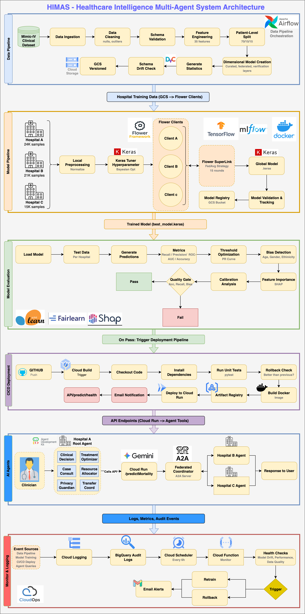

# HIMAS - Healthcare Intelligence Multi-Agent System

> **Federated Learning Platform for ICU Mortality Prediction with Privacy-Preserving Multi-Hospital Collaboration**

[](https://www.python.org/downloads/)
[](https://airflow.apache.org/)
[](https://www.tensorflow.org/)
[](https://flower.ai/)

---

## Demo Video

<p align="center">
  <a href="YOUR_VIDEO_LINK_HERE">
    
  </a>
</p>

<!-- TODO: Replace with actual video embed -->
<!-- [](YOUR_VIDEO_LINK_HERE) -->

---

## System Architecture

<p align="center">
  
</p>

*Complete MLOps pipeline showing data flow from MIMIC-IV ingestion through federated learning, model deployment, multi-agent inference, and continuous monitoring with feedback loops.*

---

## Table of Contents

- [Overview](#overview)
- [Project Structure](#project-structure)
- [Key Features](#key-features)
- [Architecture Components](#architecture-components)
  - [1. Data Pipeline](#1-data-pipeline)
  - [2. Model Pipeline (Federated Learning)](#2-model-pipeline-federated-learning)
  - [3. Model Evaluation](#3-model-evaluation)
  - [4. CI/CD Deployment](#4-cicd-deployment)
  - [5. Multi-Agent System](#5-multi-agent-system)
  - [6. Monitoring & Logging](#6-monitoring--logging)
- [Technology Stack](#technology-stack)
- [Privacy & Compliance](#privacy--compliance)

---

## Overview

HIMAS (Healthcare Intelligence Multi-Agent System) is a comprehensive MLOps platform that enables hospitals to collaboratively train AI models for ICU mortality prediction while maintaining strict data privacy and HIPAA compliance. The system uses federated learning to keep patient data local while aggregating model insights across a network of hospitals.

### Problem Statement

- **Data Silos**: Hospitals cannot share patient data due to privacy regulations
- **Model Accuracy**: Single-hospital models lack diversity and generalizability
- **Clinical Decision Support**: ICU clinicians need real-time mortality risk assessment
- **Cross-Hospital Coordination**: Patient transfers require capability matching across facilities

### Solution

HIMAS addresses these challenges through:

- **Federated Learning**: Train models across hospitals without sharing raw data
- **Privacy-Preserving Queries**: K-anonymity and differential privacy for cross-hospital consultations
- **Multi-Agent AI**: Intelligent agents for clinical decision support, resource allocation, and transfer coordination
- **End-to-End MLOps**: Automated pipelines from data ingestion to model deployment

## Project Structure

```
.
├── build-alert.yaml.           # Alert for Cloud Build pipeline status (success/failure/timeout)
├── cloudbuild.yaml             # Cloud Build with Cloud Run Deployment for ML pipeline
├── GCP                         # GCP Deployment
│   ├── flower-numpy-example    # Flower Official Quickstart
│   └── himas-federated-agents  # HIMAS Agents
├── himas_architecture.png      # HIMAS Architecture Diagram
├── LICENSE
├── PoC                         # Local Testing + GCP Deployment
│   ├── Bias Detection
│   ├── Data-Pipeline
│   ├── main.py
│   ├── Model-Pipeline
│   └── Model-Serving
└── README.md                      # This file
```

---

## Key Features

| Feature | Description |
|---------|-------------|
| **Federated Learning** | Train across 3 hospitals without centralizing patient data |
| **Privacy-First Design** | K-anonymity (k=5), Differential Privacy (ε=0.1), HIPAA compliant |
| **Multi-Agent System** | 6 specialized AI agents per hospital + federated coordinator |
| **Automated Data Pipeline** | Airflow DAGs for ETL, validation, and versioning |
| **Quality Gates** | Automated model evaluation with bias detection |
| **CI/CD Deployment** | Auto-deploy to Cloud Run with rollback capabilities |
| **Continuous Monitoring** | Drift detection, performance tracking, alerting |
| **Data Versioning** | DVC integration with GCS backend |

---

## Architecture Components

### 1. Data Pipeline

**Purpose**: Ingest, clean, transform, and version healthcare data from MIMIC-IV.

```
MIMIC-IV → Ingestion → Cleaning → Validation → Feature Engineering → Patient Split → BigQuery → DVC
```

#### Key Components

| Component | Description |
|-----------|-------------|
| **Data Source** | MIMIC-IV (PhysioNet) - ~60K ICU stays |
| **Orchestration** | Apache Airflow 3.1.0 |
| **Storage** | Google BigQuery (3 layers) |
| **Versioning** | DVC with GCS backend |

#### BigQuery Datasets

| Dataset | Purpose | Tables |
|---------|---------|--------|
| curated | Dimensional model | dim_patient, fact_hospital_admission, fact_icu_stay, fact_transfers, clinical_features, patient_split_assignment |
| federated | Hospital partitions | hospital_a_data, hospital_b_data, hospital_c_data |
| verification | Quality checks | data_leakage_check, dataset_statistics |

#### Features Engineered (35 Total)

- **Demographics**: Age, gender, ethnicity, marital status, insurance
- **Admission**: Type, location, ED flag, emergency flag, weekend/night admission
- **ICU**: Type, LOS, transfer count, mixed ICU flag, early ICU score
- **Temporal**: Hours from admission to ICU, hospital LOS

#### Data Split Strategy

- **Patient-Level Split**: Prevents data leakage (same patient never in train + test)
- **Hospital Distribution**: 40% / 35% / 25% across hospitals A, B, C
- **Train/Val/Test**: 70% / 15% / 15% within each hospital

---

### 2. Model Pipeline (Federated Learning)

**Purpose**: Train mortality prediction models using federated learning across hospitals.

```
Hospital Data → Local Preprocessing → Keras Tuner → Flower Clients ↔ Flower SuperLink → Global Model → MLflow → GCS
```

#### Federated Learning Setup

| Parameter | Value |
|-----------|-------|
| **Framework** | Flower 1.14 |
| **Strategy** | FedAvg (Federated Averaging) |
| **Rounds** | 15 |
| **Local Epochs** | 5 per round |
| **Clients** | 3 (one per hospital) |

#### Model Architecture

```python
model = Sequential([
    Dense(64, activation='relu', input_shape=(n_features,)),
    BatchNormalization(),
    Dropout(0.3),
    Dense(32, activation='relu'),
    BatchNormalization(),
    Dropout(0.2),
    Dense(16, activation='relu'),
    Dense(1, activation='sigmoid')  # Binary classification
])
```

#### Hyperparameter Tuning

- **Method**: Keras Tuner with Bayesian Optimization
- **Search Space**: Learning rate, hidden units, dropout rate, batch size
- **Objective**: Maximize validation ROC-AUC

#### Training Data Distribution

| Hospital | Role | Samples | Mortality Rate |
|----------|------|---------|----------------|
| Hospital A | Community Hospital | ~24,000 | ~11.5% |
| Hospital B | Tertiary Care Center | ~21,000 | ~12.0% |
| Hospital C | Rural Hospital | ~15,000 | ~11.2% |

---

### 3. Model Evaluation

**Purpose**: Validate model quality, detect bias, and enforce quality gates before deployment.

```
Load Model → Test Data → Predictions → Metrics → Threshold Optimization → Bias Detection → SHAP → Quality Gate → Pass/Fail
```

#### Evaluation Metrics

| Metric | Target | Description |
|--------|--------|-------------|
| **ROC-AUC** | ≥ 0.85 | Area under ROC curve |
| **Recall** | ≥ 70% | Sensitivity (critical for mortality) |
| **Precision** | ≥ 50% | Positive predictive value |
| **Accuracy** | ≥ 85% | Overall correctness |

#### Bias Detection

- **Tool**: Fairlearn
- **Protected Attributes**: Age groups, Gender, Ethnicity
- **Metrics**: Demographic parity, Equalized odds
- **Threshold**: Max disparity ratio < 1.25

#### Feature Importance

- **Method**: SHAP (SHapley Additive exPlanations)
- **Top Features**: Age, ICU LOS, Early ICU score, Emergency admission

#### Quality Gate Criteria

```yaml
quality_gates:
  accuracy: >= 0.85
  recall: >= 0.70
  roc_auc: >= 0.85
  bias_check: PASS
  calibration: Brier score < 0.15
```

---

### 4. CI/CD Deployment

**Purpose**: Automate model deployment with testing, versioning, and rollback capabilities.

```
Trigger (GitHub/Eval Pass) → Cloud Build → Tests → Rollback Check → Docker Build → Artifact Registry → Cloud Run → Notify
```

#### Pipeline Triggers

| Trigger | Condition |
|---------|-----------|
| **Model Evaluation** | Quality gates pass |
| **GitHub Push** | Push to main branch |
| **Manual** | On-demand deployment |

#### Deployment Stages

1. **Checkout**: Clone repository
2. **Install**: Install dependencies from requirements.txt
3. **Test**: Run pytest suite (DAG integrity, data leakage, DVC setup)
4. **Rollback Check**: Compare new model vs. production model
5. **Build**: Create Docker image
6. **Push**: Upload to Artifact Registry
7. **Deploy**: Deploy to Cloud Run
8. **Notify**: Send email notification

#### Cloud Run Configuration

```yaml
service:
  name: himas-prediction-api
  region: us-central1
  memory: 2Gi
  cpu: 2
  min_instances: 1
  max_instances: 10
  
endpoints:
  - /predict    # Mortality prediction
  - /health     # Health check
  - /metrics    # Prometheus metrics
```

#### Rollback Strategy

- **Automatic**: If new model performs worse than production
- **Manual**: Via Cloud Console or gcloud CLI
- **Versioning**: All models tagged with semantic versioning

---

### 5. Multi-Agent System

**Purpose**: Provide intelligent clinical decision support through specialized AI agents.

```
Clinician → Hospital Root Agent → Sub-Agents → Model API + Federated Coordinator ↔ Other Hospitals → Response
```

#### Agent Architecture

**Per-Hospital Agents** (Built with Google ADK + Gemini 2.5):

| Agent | Responsibility |
|-------|---------------|
| **Root Agent** | Orchestrates sub-agents, manages conversation |
| **Clinical Decision Support** | Mortality prediction, risk stratification |
| **Treatment Optimizer** | Treatment recommendations based on outcomes |
| **Resource Allocator** | ICU bed management, staffing optimization |
| **Case Consultation** | Cross-hospital similar case queries |
| **Privacy Guardian** | Ensures all queries meet privacy requirements |
| **Transfer Coordinator** | Patient transfer logistics |

**Federated Coordinator** (A2A Server):

| Tool | Function |
|------|----------|
| query_hospital_capabilities | Find hospitals with specific capabilities |
| query_similar_cases | Privacy-preserved case consultation |
| initiate_transfer | Coordinate patient transfers |
| get_network_statistics | Aggregated network metrics |
| anonymize_patient_data | Create privacy-safe patient fingerprints |

#### A2A Protocol Integration

```python
# Agent-to-Agent communication
from google.adk.a2a.utils.agent_to_a2a import to_a2a

root_agent = Agent(
    model="gemini-2.0-flash",
    name="federated_coordinator",
    tools=[query_hospital_capabilities, query_similar_cases, ...]
)

a2a_app = to_a2a(root_agent, port=8001)
```

#### Example Interaction

```
Clinician: "I have a 78-year-old emergency admission with early ICU score 3. 
           What's the mortality risk and are there similar cases in the network?"

Agent Response:
- Mortality Risk: 34% (High Risk)
- Similar Cases: 127 cases across network
- Network Survival Rate: 71%
- Recommendation: Consider early intervention protocol
- Transfer Option: Hospital B has advanced cardiac care if needed
```

---

### 6. Monitoring & Logging

**Purpose**: Continuous monitoring of all pipeline components with automated alerting and remediation.

```
Event Sources → Cloud Logging → BigQuery Audit → Cloud Scheduler → Cloud Function → Health Checks → Alerts → Actions
```

#### Monitored Components

| Component | Metrics |
|-----------|---------|
| **Data Pipeline** | Row counts, schema drift, null rates |
| **Model Training** | Loss, accuracy, convergence |
| **Model Serving** | Latency, throughput, error rate |
| **Agent System** | Query volume, response time, privacy violations |

#### Health Checks

```python
health_checks = {
    "model_drift": {
        "metric": "prediction_distribution_shift",
        "threshold": 0.1,  # KL divergence
        "action": "trigger_retrain"
    },
    "performance_degradation": {
        "metric": "rolling_accuracy_7d",
        "threshold": 0.80,
        "action": "alert_and_rollback"
    },
    "data_quality": {
        "metric": "null_rate_increase",
        "threshold": 0.05,
        "action": "alert_data_team"
    }
}
```

#### Alerting

| Alert Level | Channel | Response Time |
|-------------|---------|---------------|
| **Critical** | Email + PagerDuty | < 15 min |
| **Warning** | Email | < 1 hour |
| **Info** | Slack | Next business day |

#### Feedback Loops

| Trigger | Action | Target |
|---------|--------|--------|
| Model Drift | Retrain | Model Pipeline |
| Performance Drop | Rollback | CI/CD Pipeline |
| Data Quality Issue | Investigate | Data Pipeline |

#### Audit Logging (HIPAA Compliance)

```sql
-- All queries logged to BigQuery
SELECT 
    timestamp,
    user_id,
    action_type,
    patient_fingerprint,  -- Never actual patient ID
    query_parameters,
    privacy_checks_passed
FROM project.audit.access_logs
WHERE timestamp > TIMESTAMP_SUB(CURRENT_TIMESTAMP(), INTERVAL 24 HOUR)
```

---

## Technology Stack

### Core Technologies

| Category | Technology | Version | Purpose |
|----------|------------|---------|---------|
| **Orchestration** | Apache Airflow | 3.1.0 | Pipeline DAGs |
| **ML Framework** | TensorFlow/Keras | 2.x | Model training |
| **Federated Learning** | Flower | 1.14 | FL framework |
| **Experiment Tracking** | MLflow | Latest | Model registry |
| **Data Warehouse** | BigQuery | - | Data storage |
| **Object Storage** | GCS | - | Artifacts |
| **Data Versioning** | DVC | 3.x | Dataset versioning |
| **AI Agents** | Google ADK | Latest | Agent framework |
| **LLM** | Gemini 2.5 Flash | - | Agent reasoning |
| **Containerization** | Docker | Latest | Packaging |
| **Deployment** | Cloud Run | - | Model serving |
| **CI/CD** | Cloud Build | - | Automation |
| **Monitoring** | Cloud Operations | - | Observability |

---

## Privacy & Compliance

### Privacy-Preserving Techniques

| Technique | Implementation | Parameter |
|-----------|----------------|-----------|
| **K-Anonymity** | Minimum group size for queries | k = 5 |
| **Differential Privacy** | Laplace noise on aggregates | ε = 0.1 |
| **Patient Fingerprinting** | SHA-256 hash with daily salt | - |
| **Age Bucketing** | 5-year buckets | e.g., 75-80 |
| **Risk Score Generalization** | 0.1 range buckets | e.g., 0.3-0.4 |

### HIPAA Compliance

- No PHI transmitted between hospitals
- All cross-hospital queries return aggregates only
- Complete audit trail in BigQuery
- Automatic privacy checks before data sharing
- Patient-level data never leaves source hospital

### Data Governance

```python
# Privacy Guardian checks every cross-hospital query
def validate_query(query_params):
    checks = [
        check_k_anonymity(query_params),
        check_no_direct_identifiers(query_params),
        check_minimum_aggregation(query_params),
        log_audit_trail(query_params)
    ]
    return all(checks)
```

---

## License

This project is licensed under the MIT License - see the [LICENSE](LICENSE) file for details.

---

## References

- [MIMIC-IV Dataset](https://physionet.org/content/mimic-iv-fhir/2.1/)
- [Flower Federated Learning](https://flower.ai/)
- [Google Agent Development Kit](https://google.github.io/adk-docs/)
- [Apache Airflow Documentation](https://airflow.apache.org/docs/)

---

<p align="center">
  <b>HIMAS - Enabling Collaborative Healthcare AI While Preserving Patient Privacy</b>
</p>

<p align="center">
  🏥 Federated Learning • 🔒 Privacy-First • 🤖 Multi-Agent AI • ☁️ Cloud-Native
</p>
# Deployment demo
# Deployment demo
# Deployment demo
